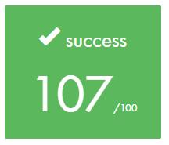

# PUSH_SWAP

Sort a series of random integers using only two stacks and a specific set of commands. The "push_swap" program finds the most efficient way to sort the stack and returns a series of commands. These commands when piped to the "checker" executable will confirm or deny whether the stack has been sorted by outputting either "OK" or "KO".

* `sa` : swap a - swap the first 2 elements at the top of stack a.
* `sb` : swap b - swap the first 2 elements at the top of stack b.
* `ss` : sa and sb at the same time.
* `pa` : push a - take the first element at the top of stack b and push it to stack a.
* `pb` : push b - take the first element at the top of stack a and push it to stack b.
* `ra` : rotate a - shift all elements of stack a upwards by 1. The first element becomes the last.
* `rb` : rotate b - shift all elements of stack b upwards by 1. The first element becomes the last.
* `rr` : ra and rb at the same time.
* `rra` : reverse rotate a - shift downwards all elements of stack a by 1. The last element becomes the first.
* `rrb` : reverse rotate b - shift downwards all elements of stack b by 1. The last element becomes the first.
* `rrr` : rra and rrb at the same time.

### Installing

Clone the "push_swap" repository to your system. This will create a folder called "push_swap" containing all the necessary files.

```
git clone https://github.com/vanniekerkalex/push_swap.git
```

Compile the program by executing the Makefile in the repository directory as follows:

```
make re
```

## Running the tests

Execute the the following command which will generate 50 random numbers, send it to the "push_swap" program which will in turn send the sorting commands to "checker" for confirmation of a sorted stack.

```
ARG=`ruby -e "puts (0..49).to_a.shuffle.join(' ')"`; ./push_swap $ARG | ./checker $ARG
```

To activate the visualizer for the "push_swap" program. Add the command "-v" after "./checker" and before "$ARG" as follows:

```
ARG=`ruby -e "puts (0..49).to_a.shuffle.join(' ')"`; ./push_swap $ARG | ./checker -v $ARG
```

## Built With

* [Atom](http://atom.io/) in C

## Visualizer

Image 1 of 7 - Starting the sort.

<p align="center">
<br>
</p>

Image 2 of 7

<p align="center">
<br>
</p>

Image 3 of 7

<p align="center">
<br>
</p>

Image 4 of 7

<p align="center">
<br>
</p>

Image 5 of 7

<p align="center">
<br>
</p>

Image 6 of 7

<p align="center">
<br>
</p>

Image 7 of 7 - Sorting completed.

<p align="center">
<br>
</p>
